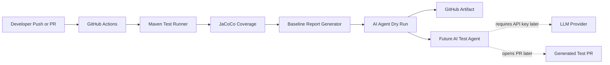
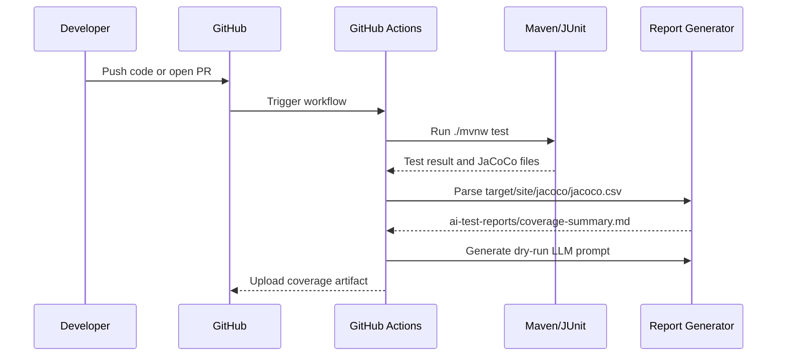
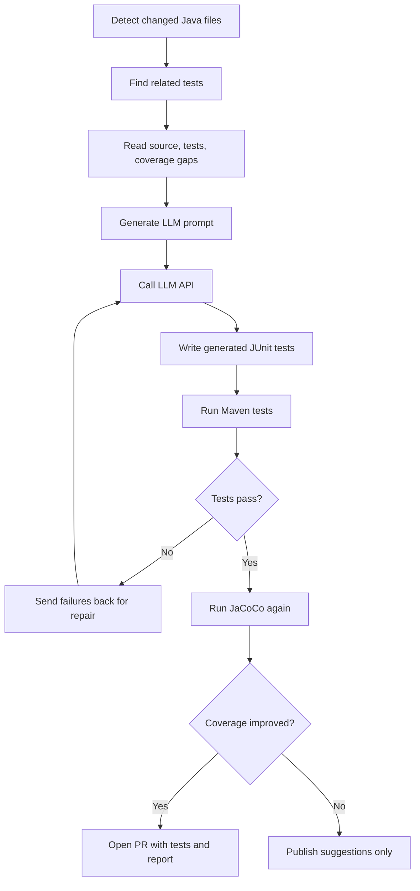

# Agentic AI Unit Test Coverage Optimizer

## MVP Goal

Build a GitHub Actions based agent workflow for a Java Spring Boot microservice that measures current unit test coverage, identifies weak classes, and prepares the system for AI-generated JUnit tests.

The current phase intentionally runs without an LLM API key. It establishes the engineering foundation: tests, coverage, reporting, and CI.

## Phase 0: Before LLM API Usage

- Java Spring Boot sample service is available.
- JUnit 5 tests can run locally and in CI.
- JaCoCo generates coverage reports.
- A baseline Markdown report is generated under `ai-test-reports/`.
- A dry-run AI agent generates the future LLM prompt without calling any paid API.
- GitHub Actions uploads coverage artifacts.
- The LLM test-generation step is represented as a future extension point.

## High-Level Architecture



## CI Flow



## Future Agent Workflow



## Local Commands

Run tests and generate JaCoCo:

```bash
./mvnw test
```

Generate the baseline AI report:

```bash
python3 scripts/coverage_summary.py
```

Generate the no-cost AI agent dry run:

```bash
python3 scripts/ai_test_agent_dry_run.py
```

Run the repeatable manual AI agent flow:

```bash
python3 scripts/ai_test_agent.py --mode manual --phase prepare
python3 scripts/ai_test_agent.py --mode manual --phase verify
```

Optional strict 80 percent coverage gate. In the current baseline this may fail, which is useful for the demo because the future AI agent should raise coverage above this threshold:

```bash
./mvnw verify -Pcoverage-check
```

## Next Milestone

The manual AI-mode flow is now proven: the dry-run prompt identified a weak class, additional JUnit tests were added, and the project passed the strict 80 percent coverage gate.

Next, add the AI test agent provider interface. The first paid provider can be OpenAI API or AWS Bedrock, while the current manual provider keeps the same workflow available with ChatGPT Pro.
